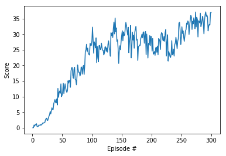

## Learning algorithm

To train the agent the code provided on the course was used. It implements the **Deep Deterministic Policy Gradients** algorithm, that uses neural networks to approximate the Q value for **action - state pairs** and the action to take.

### Network architecture

* Actor network with one hidden layer was used with RELU activation. 256 nodes.
* Critic network with two hidden layer was used with RELU activation. 256 and 128 nodes.

## Hyper-parameters

Following hyperparameters were used to train the agent.

* BUFFER_SIZE = int(1e6)
* BATCH_SIZE = 512
* GAMMA = 0.99
* TAU = 1e-3
* LR_ACTOR = 1e-4
* LR_CRITIC = 3e-4
* WEIGHT_DECAY = 0

## Reward plot
Following reward plot was obtained when the agent was trained.

## Ideas to improve the performance of the agent

* Further experimentation will be done with the agent using the PPO, A2C and D4PG.
* Agent might also be trained by taking direct screen pixels as the input.

